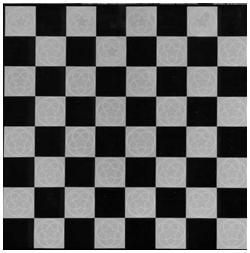
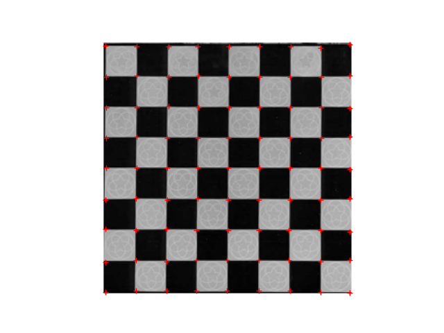

# Harris Corner Detector :

In this work, we present an implementation of the Harris corner detector whitout OpenCV to detect corners in a chessboard image. This feature detector relies on the analysis of the eigenvalues of the autocorrelation matrix. The algorithm comprises several steps, including several measures for the classification of corners, a generic non-maximum suppression method for selecting interest points, and the possibility to obtain the corners position with subpixel accuracy.

A corner is a point whose local neighborhood stands in two dominant and different edge directions. In other words, a corner can be interpreted as the junction of two edges, where and edge is sudden change in image brightness. Corners are the important deatures in the image, and they are generally termed as interest points which are invariant to translation, rotation and illumination.

The idea behind the Harris corner detection algorithm is to locate interest points where the surrounding neighbourhood shows edges in more the one direction. The basic idea is to find the difference in intensity for a displacement of (u,v) in all directions.

## Process of Harris Corner Detection Algorithm :

The Harris Corner Detector algorithm in simple words is as follows :

**Step 1:** Compute horizontal and vertical derivatives of image Ix & Iy.

**Step 2:** Compute three images corresponding to three terms in matrix M (Ix², Iy² and IxIy).

**Step 3:** Convolve three images with a larger Gaussian.

**Step 4:** Compute scalar cornerness value using one of the R measures.
 
**Step 5:** Find local maxima above some threshold as detected interest point.

## Result : 

<table><tr>
<td> 
  

    
    <em>Input Image</em>
  
 
</td>
<td> 
  

    
    <em>Harris Output</em>
  
 
</td>
</tr></table>

## Conclusion :
In this work, we presented an implementation of the Harris corner detector to select the prominent features on the image. To improve the speed of the method, it is necessary to implement a faster Gaussian convolution technique, or to replace it with a box filter, at the expense of an accuracy loss.

The final output depends on the threshold and the distance value. Also, it depend on the size of the matrix. For 3x3 matrix, it was not so good and contained some non-corner points too. But for 9x9 matrix, the output was accurate enough to in-built harris detector.

The detector algorithm implemented relies on the analysis of the eigenvalues of the auto-correlation matrix. The algorithm comprises several steps, including several measures for the classification of corners, a generic non-maximum suppression method for selecting interest points, and the possibility to obtain the corners position with subpixel accuracy.
